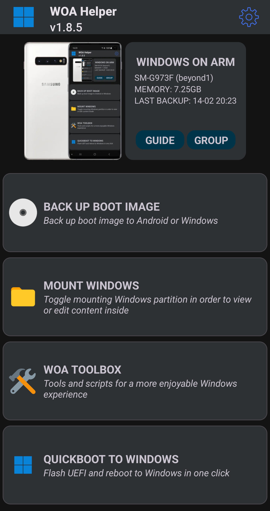
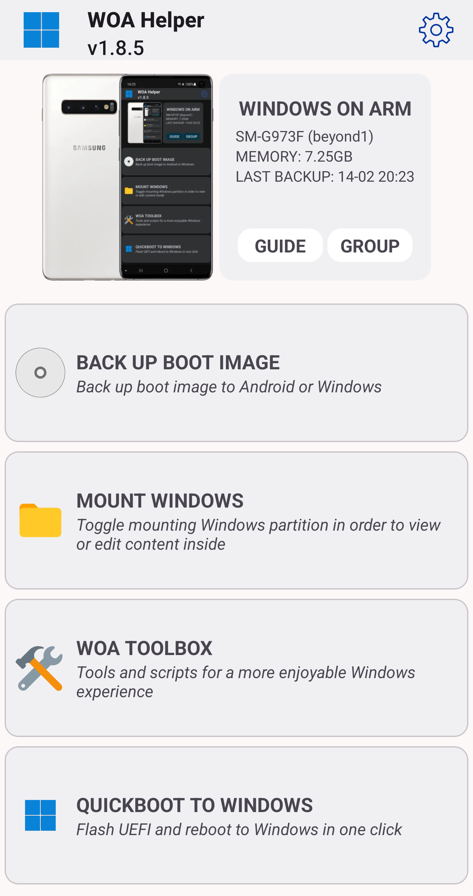

# WoA-Helper
<p float="left" >


</p>

> [!WARNING]
> 
> We're not responsible for bricked devices, missing recovery partitions, dead microSD cards, dead cats or dogs, nuclear wars or you getting fired because of you forgetting to boot back into Android for your alarm.

## Project status
This project is in late stages of development. Most features have already been added, while some others are still in development. The code may also be refinded in the future, to make everything more seamless.

## Features
- [x] Backup Android Boot ```will be stored in internal storage and/or in Windows```
- [x] Mount/Unmount Windows partition ```to view/modify Windows files from Android```
- [x] Automount Windows ```Optionally automatically mounts Windows when the device starts```
- [x] Flash UEFI ```to use the UEFI flashing feature, you need to place the UEFI image in /sdcard/UEFI```
- [x] StA Creator ```creates dualboot files```
- [x] Script Toolbox ```containing various script and tools used in Windows, such as;```
- Edge Remover
- Defender Remover
- USB host mode toggle
- Display rotation script (for devices without sensors)
- Direct links to AtlasOS and ReviOS
- Android boot auto flasher (currently not working)
- etc.
- [x] Provisioning Modem
- [x] Quick Boot to Windows

## Requirements
• Android 8 and up

• Rooted device with Windows installed

• UEFI image

## Credits
- [KuatoDev](https://github.com/KuatoDev) for making the original app
- [Halal Beef](https://github.com/halal-beef) for updating the original app
- [Bibarub](https://github.com/bibarub) for being involved in the original app
- [Marius586](https://github.com/Marius586) for updating the original app and adding lots of features
- [the sog](https://github.com/n00b69) for updating Marius' fork and adding lots of features
- [Ali](https://github.com/gixousiyq) for helping refine code and for the Arabic translation
- Aven1us for the Azeri translation
- [Chiyuki](https://github.com/chiyuki0325), Sui2786 & TTK for the Chinese translation
- [index986](https://github.com/index986) for the Czech translation
- YourAvgEngineer for the French translation
- [ArToSeVeN](https://github.com/Artoseven) for the Indonesian translation
- [galaxysollector](https://github.com/galaxysollector) for the Korean translation
- Win Polish for the Polish translation
- [AdrianoA3](https://github.com/AdrianoA3) for the Portuguese translation
- JadeKubPom for the Thai translation
- sercancamli & [ErdilS](https://github.com/erdilS) & [Kaan Dikeç](https://github.com/dikeckaan) for the Turkish translation
- [Ost268](https://github.com/Ost268) and [Ilya114](https://github.com/Ilya114) for the Ukrainian translation
- HieusayHi for the Vietnamese translation


